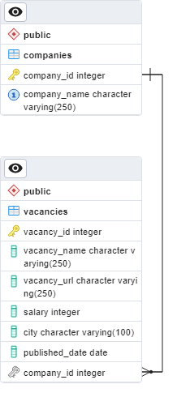

# Курсовая работа 5. Работа с базами данных

### Цель работы
В рамках проекта необходимо получить данные о компаниях и вакансиях с сайта hh.ru, спроектировать таблицы в БД PostgreSQL и загрузить полученные данные в созданные таблицы.

### Графическая схема БД

### Структура репозитория
* data
  * **companies.txt:** файл с названиями компаний, для которых будет осуществляться поиск вакансий
  * **create_tables.sql:** файл с SQL-запросами для создания таблиц в БД
  * **queries.sql:** файл с SQL-запросами в БД
  * **db_config.ini**: файл с настройками подключения к БД (dbname - название БД, user - имя пользователя,
passsword - пароль, host - адрес хоста, port - порт, queries - путь к файлу с SQL-запросами)
* **database.py:** модуль,содержащий определение класса, предназначенного для управления работой БД PostgreSQL. Класс содержит
методы для установления соединения с БД, выполнения запросов к БД, закрытия соединения с БД и создания таблиц в БД.
Класс использует библиотеку psycopg2 для взаимодействия с PostgreSQL и QueryManager для получения SQL-запросов. 
Класс также использует логирование для регистрации действий, связанных с выполнением запросов.
* **queries_manager.py:** модуль, содержащий определение класса QueryManager. Это менеджер для работы с SQL-запросами.
Он загружает SQL-запросы из файла в словарь queries, где ключ - комментарий перед запросом, значение - SQL-запрос. 
Для создания объекта этого класса нужно указать путь к файлу с SQL-запросами.
* **headhunter.py**: модуль, содержащий определение двух классов: HeadHunterBase и HeadHunter. 
HeadHunterBase является абстрактным базовым классом и определяет базовую функциональность для работы с сервисом поиска работы HeadHunter. 
HeadHunter является дочерним классом, который наследует от HeadHunterBase и реализует конкретную функциональность поиска и обработки данных о вакансиях на HeadHunter.
* **fill_db.py:** этот модуль связывается с базой данных, получает список компаний из файла, создает таблицы в базе данных, 
проверяет наличие компании в базе данных и добавляет ее, если ее нет (получение идентификатора компании осуществляется с помощью API HeadHunter). Затем он получает список идентификаторов компаний из базы данных, 
получает список вакансий для каждой компании и проверяет наличие вакансии в базе данных, добавляя ее, если ее нет (получение информации о вакансиях компании осуществляется с помощью API HeadHunter). 
* **utils.py:** модуль, содержащий вспомогательные функции
* **logger_config.py:** модуль настраивает систему логирования. Он использует модуль logging и определяет конфигурацию логирования с помощью словаря dict_config. 
В модуле созданы экземпляры логеров 'db_logger' и 'hh_logger'.
* flake8: конфигурационный файл для линтера flake8
* requirements.txt: библиотеки, необходимые для работы

### Используемые технологии
* python (3.10)
* requests
* psycopg2
* flake8

### Установка
1. Скопировать всё содержимое из репозитория в новый каталог.

2. Создать виртуальное окружение и активировать его

```bash
python3 -m venv venv venv/Scripts/activate
```

3. Перейти в корневую папку и установить требуемые пакеты

```bash
pip install -r requirements.txt
```

### Как работать с проектом
1. Установить PostgreSQL, если он не установлен.
2. Создать БД head_hunter, для этого:
  * Запустить командную оболочку psql от пользователя с правами администратора
  ```bash
  psql -U postgres
  ```
  * Ввести пароль
  * Создать БД head_hunter
  ```postgresql
CREATE DATABASE head_hunter;
  ```
  * Выйти из командной оболочки psql
  ```
  exit
  ```
3. В конфигурационном файле **db_config.ini** проверить настройки подключения к БД. Если необходимо, указать актуальные настройки.
4. Для заполнения БД данными выполнить команду:
```bash
python fill_db.py
```
5. Класс DBManager имеет следующие методы:
- `get_companies_and_vacancies_count()`: возвращает список всех компаний и количество вакансий у каждой компании.
- `get_all_vacancies()`: возвращает список всех вакансий с указанием названия компании, названия вакансии и зарплаты, ссылки на вакансию и города.
- `get_avg_salary()`: возвращает среднюю зарплату по вакансиям.
- `get_vacancies_with_higher_salary()`: возвращает список всех вакансий, у которых зарплата выше средней по всем вакансиям.
- `get_vacancies_with_keyword()`: возвращает список всех вакансий, в названии которых содержатся переданные в метод слова, например “python”.

Для того чтобы воспользоваться этими методами:
* импортируйте класс DBManager из модуля database.py;
* внутри блока with создайте экземпляр класса DBManager,
который инициализируется с помощью пути к файлу конфигурации базы данных, 
указанного в аргументе config_file_path
* вызовите интересующие вас методы.

Пример:

```python
from database import DBManager

with DBManager(config_file_path='data/db_config.ini') as db:
  print(db.get_companies_and_vacancies_count())
  print(db.get_avg_salary())
  print(db.get_vacancies_with_keyword(keyword='Python'))
```
